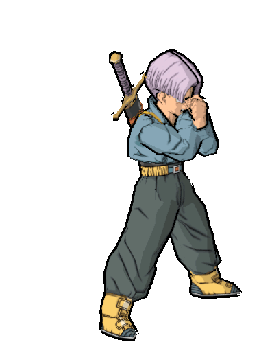

   

  
  
   
  
   

### Hi there 👋

<h3>Various techs I use</h3>

  
    
  
  
  
  
  
  
  
  
  
  
  
  
  
  
  
  
  
  

<h3>I want to use more</h3>

  
  
  
 
   
 
 
  
  
  

<h3>Youtube badge</h3>

   

                                

 
  
  
  

  
 
 
  
 
 
  
  
 
    
 
   

### Link to pimp your github

[For the badges use shields](https://shields.io/)

[Find the good bagde code](https://simpleicons.org/)

[Stats](https://github.com/anuraghazra/github-readme-stats)

[Video](https://youtu.be/NEemH60QoCE)
